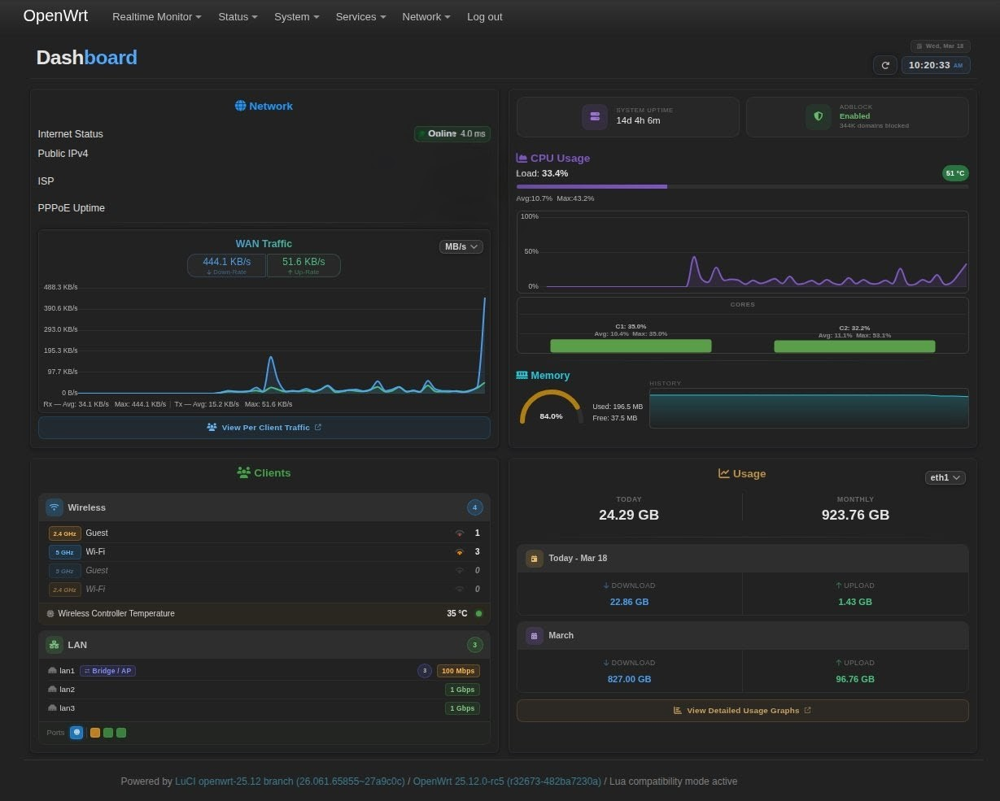

# LuCI Realtime Monitor

Real-time dashboard and per-client bandwidth monitor for OpenWrt.
Polls a Lua backend every 1–10 seconds and renders live charts and
stats inside the LuCI web UI. No external services or build tools required.

---

## Installation

### For OpenWrt v25.12 or newer (.apk)
```bash
wget --no-check-certificate -O /tmp/luci-app-realtime-monitor.apk https://github.com/OppsError404/luci-app-realtime-monitor/releases/download/v1.0.0-r1/luci-app-realtime-monitor-1.0.0-r1.apk && \
apk add --allow-untrusted /tmp/luci-app-realtime-monitor.apk && \
rm -f /tmp/luci-app-realtime-monitor.apk
```

### For OpenWrt v24.10.5 or older (.ipk)
```bash
wget --no-check-certificate -O /tmp/luci-app-realtime-monitor.ipk https://github.com/OppsError404/luci-app-realtime-monitor/releases/download/v1.0.0-r1/luci-app-realtime-monitor_1.0.0-r1.ipk && \
opkg install /tmp/luci-app-realtime-monitor.ipk && \
rm -f /tmp/luci-app-realtime-monitor.ipk
```

## Uninstallation

### For OpenWrt v25.12 or newer (.apk)
```bash
apk del luci-app-realtime-monitor
```

### For OpenWrt v24.10.5 or older (.ipk)
```bash
opkg remove luci-app-realtime-monitor
```

## Features

### Dashboard
- WAN RX/TX live rates with rolling chart
- Internet ping status and RTT
- PPPoE / DHCP / Static WAN detection and uptime
- Public IP, ISP name, ASN (12h cache)
- CPU usage — overall + per-core bars + line chart
- CPU and Wi-Fi chip temperatures
- RAM arc gauge, bar, and sparkline chart
- System uptime
- vnStat daily and monthly traffic totals (optional)
- Adblock domain count and status (optional)

### Client Monitor
- Live RX/TX rates per connected device
- Groups clients by band: LAN / 2.4 GHz / 5 GHz / 6 GHz / Bridge+AP
- Wi-Fi signal strength and TX/RX bitrate per client
- Per-MAC nftables byte counters
- Hostname resolution via DHCP leases and ARP
- Bridge and AP sub-client tracking with background ping-gate
- Interface aggregate rates card
- Scrolling 300-second canvas graph per client
- Responsive desktop and mobile layouts
- Unit toggle MB/s ↔ Mbps, poll interval 1–10s, both persisted

---

## Dependencies

### Required
- luci
- luci-compat
- nftables (nft) — per-client rate counters
- ip-bridge

### Optional
- vnstat — daily/monthly traffic stats
- adblock or adblock-fast — domain count widget

### Frontend (CDN)
- Chart.js 3.x
- Font Awesome 6.5

---

## URLs

    /cgi-bin/luci/admin/realtime/dashboard
    /cgi-bin/luci/admin/realtime/client
    /cgi-bin/luci/admin/status/dashboard          (JSON API)
    /cgi-bin/luci/admin/status/dashboard/force    (force cache clear)
    /cgi-bin/luci/admin/client_monitor/data       (JSON API)

---

## Notes

- nftables + br_netfilter required for client rate counters.
  If rates show zero on bridge ports: modprobe br_netfilter
- vnstatd must be running for traffic stats to accumulate.
- All cache files live in /tmp and reset on reboot.

---

## Screenshots


